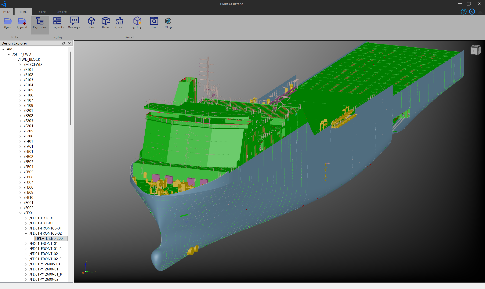
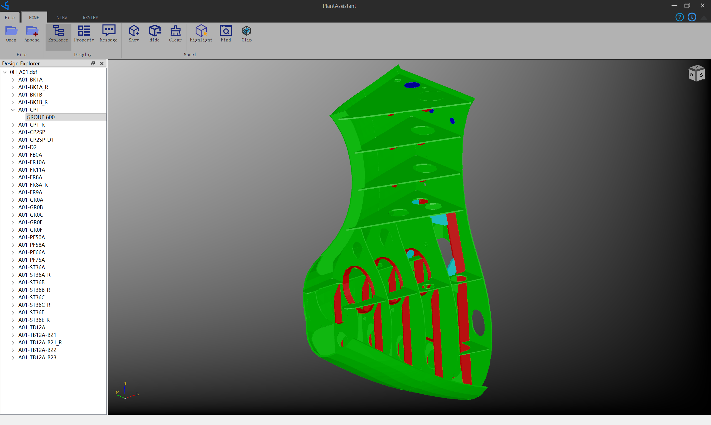
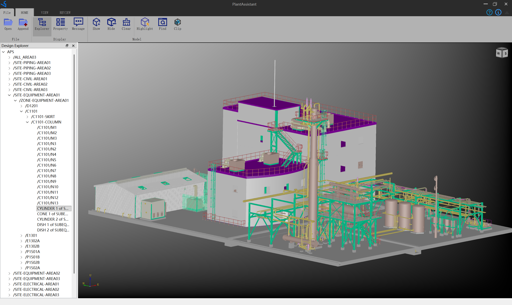
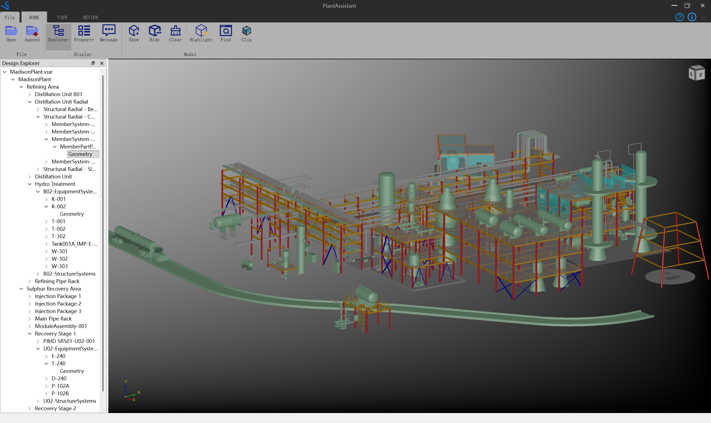
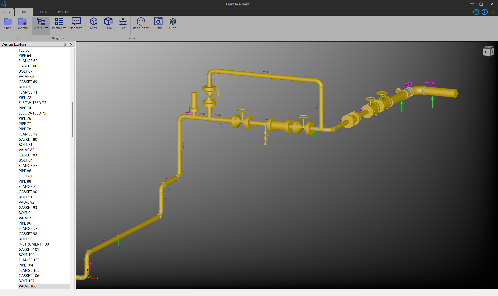

# PlantAssistant - Review plant model files.

`PlantAssistant` support to review the following model files:

| Plant Design System | Model Files |
| --------------------| ------------|
| AVEVA PDMS/E3D      | RVM/ATT     |
| Intergraph SmartPlant3D | VUE/(MDB2, XML) |
| AVEVA Tribon | 3D DXF |
| Piping Data File | PCF,IDF|

## AVEVA Marine RVM Ship

## Tribon 3D DXF

## AVEVA Plant RVM Plant

## Intergraph Smart 3D VUE Plant

## PCF Pipe

## Notice

**PlantAssistant is not open source software. You can use 3D view function of PlantAssistant freely.**

**PlantAssistant 不是开源软件，但你可以免费使用3D浏览功能。**

## Feedback

TUHE TEAM (whtuhe@qq.com)
